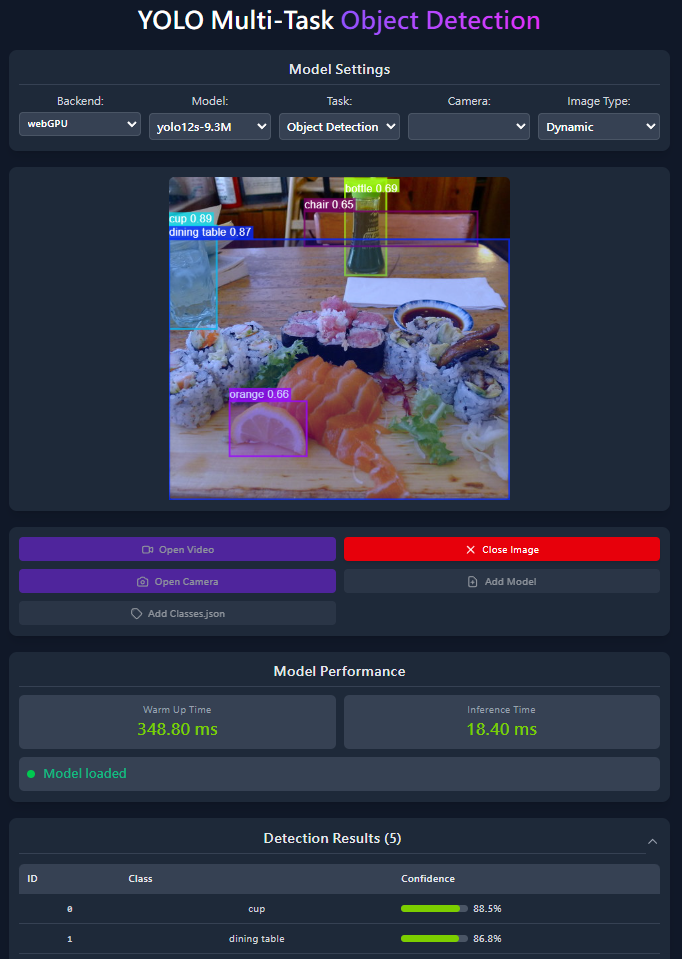

# 🚀 YOLO Multi-Task Web App

<div align="center">


<br>

[](https://onnxruntime.ai/)
[](https://github.com/ultralytics/ultralytics)
[](LICENSE)

</div>

## 📖 Introduction

This web application, built on **ONNX Runtime Web**, brings the power of YOLO directly to your browser. It supports full client-side inference for Object Detection, Pose Estimation, and Instance Segmentation without sending data to a server.

## ⚠️ WebGPU Prerequisites (Important)

To achieve the best performance using **WebGPU**, please ensure the following:

1.  **Browser**: Use a Chromium-based browser (Chrome, Edge, Brave).
2.  **Enable Flags**:
    - Type `chrome://flags` (or `edge://flags`) in your address bar.
    - Search for **"Unsafe WebGPU Support"** and set it to **Enabled**.
    - **(Linux / Android users)**: Search for **"Vulkan"** (`#enable-vulkan`) and set it to **Enabled**.
    - Relaunch your browser.

> 💡 **Note**: If WebGPU is not available, the app will automatically fall back to WASM (CPU), which is slower but universally compatible.

## ✨ Features

- 🔍 **Object Detection** - Precisely identify and locate various objects.
- 👤 **Pose Estimation** - Real-time human keypoint tracking.
- 🖼️ **Instance Segmentation** - Pixel-level object masking and identification.
- ⚡ **High Performance** - Powered by WebGPU acceleration.

## 📹 Input Support

| Input Type         |  Format  | Use Case                                  |
| :----------------- | :------: | :---------------------------------------- |
| 📷 **Image**       | JPG, PNG | Single image analysis & batch processing. |
| 📹 **Video**       |   MP4    | Offline video analysis & content review.  |
| 📺 **Live Camera** |  Stream  | Real-time monitoring & interactive demos. |

## 📊 Model

This project is fixed to **YOLO26-n**. The browser app and catalogue extractor both load YOLO26-n ONNX files from `public/models/`.

_The model is licensed under [AGPL-3.0](./public/models/LICENSE.txt) via [Ultralytics](https://github.com/ultralytics/ultralytics)._

## 🛠️ Installation

1. **Clone the repository**

   ```bash
   git clone https://github.com/nomi30701/yolo-multi-task-onnxruntime-web.git
   cd yolo-multi-task-onnxruntime-web
   ```

2. **Install dependencies**

   ```bash
   yarn install
   ```

3. **Run Development Server**

   ```bash
   yarn dev
   ```

4. **Build for Production**
   ```bash
   yarn build
   ```

## 🔧 Classes

If you need custom class labels, update the class definitions:

- **UI Method**: Click **"Add Classes.json"** to upload a JSON file mapping class IDs to names.
- **Code Method**: Update `src/utils/yolo_classes.json`.

```json
{
  "class": {
    "0": "person",
    "1": "bicycle"
  }
}
```

## ⚙️ Configuration: Image Processing

You can control how images are pre-processed via the `imgsz_type` setting:

- **Dynamic (Default)**:

  - Uses the original image aspect ratio.
  - **Pros**: Best accuracy.
  - **Cons**: Slower on large images; inference time varies.
  - _Requires model exported with `dynamic=True`._

- **Zero Pad (Square)**:
  - Pads image to square and resizes to 640x640.
  - **Pros**: Consistent, faster speed suitable for real-time video.
  - **Cons**: Slight accuracy drop on small objects due to scaling.
